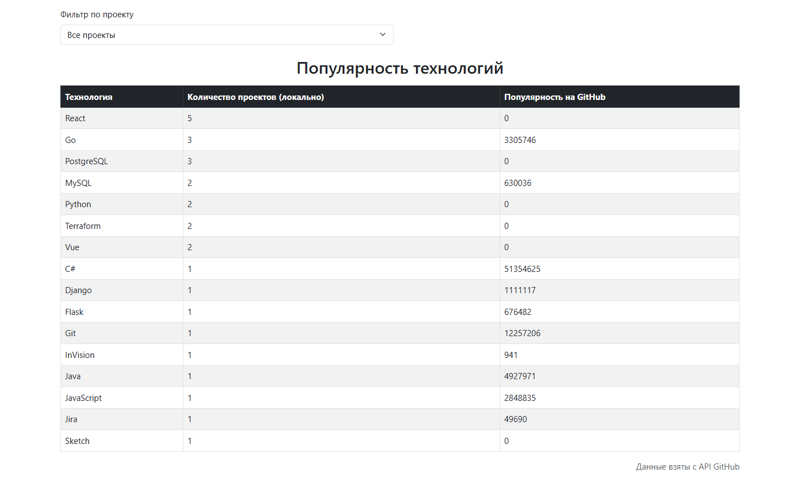
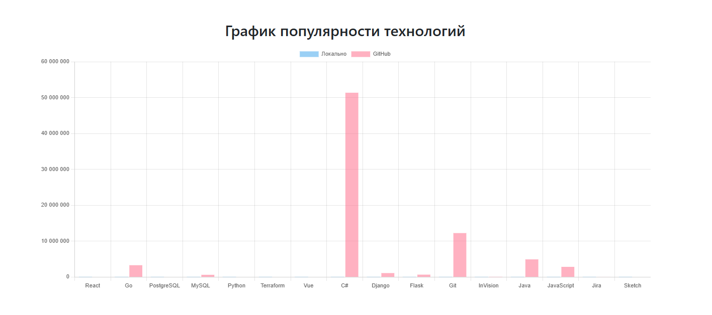
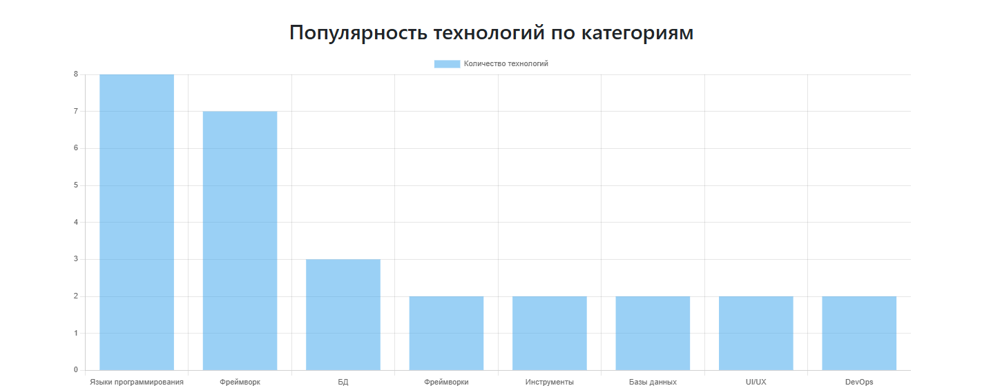
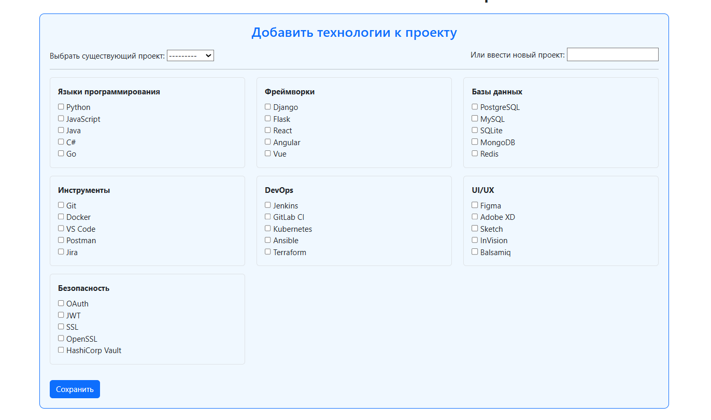
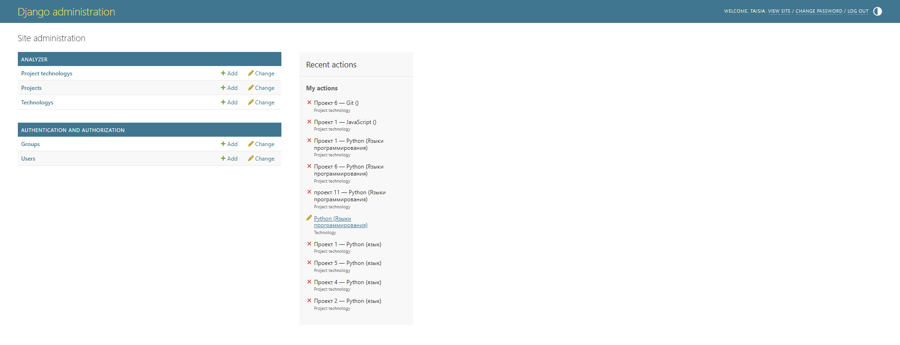
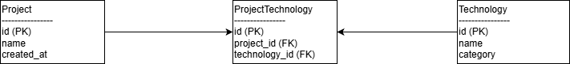

# IT Experience

Сервис для анализа и визуализации технологий, используемых в IT-проектах. Позволяет просматривать проекты, добавлять технологии и категории, а также получать интерактивные графики популярности технологий по проектам и категориям.

Ссылка на рабочий проект: [https://it-expenses.onrender.com/]

## Технологии
* Python 3.13
* Django 6.0.1
* Pandas 2.3.3
* Plotly 6.5.2
* NumPy 2.4.1
* Bootstrap 5.3
* Chart.js
* Requests 2.31.0
* Django Widget Tweaks 1.4.12
* Gunicorn 21.2.0
* Whitenoise 6.11.0

## Скриншоты


*Главная страница с фильтром проектов и таблицей технологий (home.png)*


*График популярности технологий (локально и на GitHub) (tech_chart.png)*


*Интерактивный график технологий по категориям (category_chart.png)*


*Форма Django для добавления технологий к проекту (add_technology.png)*


*Стандартная Django Admin с настройками list_display и search_fields (admin_panel.png)*

## Архитектура проекта
Проект использует следующие модели данных:

1. **Project** – информация о проекте  
   Поля: `name` (название), `description` (описание)

2. **Technology** – информация о технологии  
   Поля: `name` (название), `category` (категория технологии)

3. **ProjectTechnology** – связь между проектами и технологиями  
   Поля: `project` (ForeignKey к Project), `technology` (ForeignKey к Technology)

ER-диаграмма базы данных:


*Схема связей моделей Project, Technology и ProjectTechnology*

## Ключевой функционал
* Просмотр списка проектов и связанных технологий
* Добавление технологий к проектам через формы Django
* Фильтрация проектов и технологий
* Динамическая визуализация популярности технологий и категорий с использованием Chart.js и Plotly
* Получение данных о популярности технологий через GitHub API

## Внешние интеграции / Аналитика
* **GitHub API** – для получения статистики популярности технологий
* **Pandas** – для обработки и агрегации данных по проектам
* **Plotly и Chart.js** – для построения интерактивных графиков

## Как запустить проект локально
1. Клонируйте репозиторий:

```bash
git clone https://github.com/Khtaisia/it_expenses.git
```

2. Перейти в директорию проекта:

```bash
cd it_expenses
```

3. Создать и активировать виртуальное окружение:

```bash
python -m venv venv
# Для Windows
venv\Scripts\activate
# Для Linux/Mac
source venv/bin/activate
```

4. Установить зависимости:

```bash
pip install -r requirements.txt
```

5. Выполнить миграции:

```bash
python manage.py migrate
```

6. Создать суперпользователя (администратора):

```bash
python manage.py createsuperuser
```

7. Запустить сервер:

```bash
python manage.py runserver
```

8. Открыть проект в браузере:

```bash
# После запуска сервер будет доступен по адресу:
http://127.0.0.1:8000/
```

## Админка

* Для управления проектами, технологиями и связями используется стандартная Django Admin:
 1. Поля list_display и search_fields настроены для удобства
 2. Доступ по URL: /admin

## Демо-версия

* Ссылка на деплой на Render: [https://it-expenses.onrender.com/]